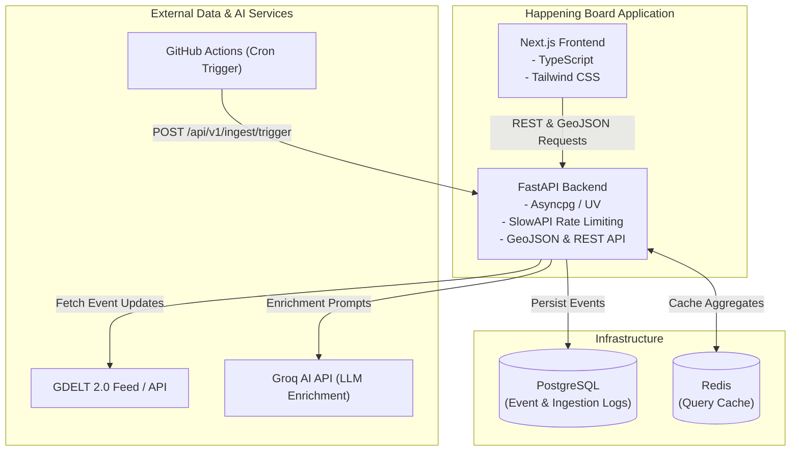

# Happening Board

> **Global Conflict Monitoring Platform**  
> Ingesting, enriching, and visualizing real-time geopolitical and conflict events from GDELT 2.0 with AI classification and analytics.


---

## Overview

**Happening Board** is an open-source intelligence monitoring platform designed to ingest high-velocity world event streams, enrich them with metadata and AI-driven conflict classifications, and present actionable insights via an interactive dashboard.

Key capabilities include:

- **Real-Time GDELT 2.0 Ingestion**: Pulls the latest global event records and news coverage from the GDELT 2.0 live feeds every 15 minutes.
- **AI-Powered Event Enrichment**: Analyzes news and event mentions with Groq LLM integration (with automated heuristic fallback) to categorize conflicts, assess severity (1–5), extract actors, and summarize incidents.
- **High-Performance Geospatial & Filtered Queries**: PostgreSQL storage with optimized indexes and GeoJSON endpoints for map and spatial analysis.
- **Multi-Tier Caching**: Sub-millisecond response times using Redis cache layer for high-frequency dashboard queries.
- **Modern Interactive Dashboard**: Next.js, Tailwind CSS, and shadcn/ui with dark mode, live statistics, category breakdowns, and keyword filters.
- **Production-Ready Containerization**: Dockerfiles for both services and a unified `docker-compose.yml` for local orchestration or cloud deployments.

---

## Architecture



---

## Tech Stack

| Domain | Technology | Details |
| --- | --- | --- |
| **Frontend** | [Next.js](https://nextjs.org) (App Router) | TypeScript, Standalone multi-stage build |
| **Styling & UI** | [Tailwind CSS](https://tailwindcss.com), [shadcn/ui](https://ui.shadcn.com) | Modern responsive dark/light mode interface |
| **Backend** | [FastAPI](https://fastapi.tiangolo.com) | Python, async / ASGI, SlowAPI rate limiting |
| **Package Managers** | [uv](https://github.com/astral-sh/uv) (backend), [pnpm](https://pnpm.io) (frontend) | Blazing-fast dependency resolution and deterministic lockfiles |
| **Database** | [PostgreSQL](https://www.postgresql.org) | Relational storage with connection pooling |
| **Caching** | [Redis](https://redis.io) | Key-value store for API responses with configurable TTL |
| **AI Enrichment** | [Groq API](https://groq.com) | High-throughput LLM inference for classification |
| **Deployment** | [Docker](https://www.docker.com) & [Docker Compose](https://docs.docker.com/compose/) | Lean Alpine multi-stage containers |
| **CI / Automation** | [GitHub Actions](https://github.com/features/actions) | Ingestion crons and 7-day data retention cleanup |

---

## Repository Structure

```text
happening-board/
├── .github/
│   └── workflows/
│       ├── ingest.yml           # Scheduled cron ingestion (every 15 min)
│       └── cleanup.yml          # Weekly database retention prune
├── backend/
│   ├── app/
│   │   ├── api/v1/              # Endpoints: events, stats, ingest
│   │   ├── db/                  # Connection pool and schema initialization
│   │   ├── models/              # Pydantic data schemas
│   │   ├── services/            # Ingestion, cache, and Groq AI enrichment
│   │   ├── config.py            # Pydantic settings & environment configuration
│   │   └── main.py              # FastAPI application entrypoint
│   ├── Dockerfile               # Python 3.12-slim container with uv
│   ├── pyproject.toml           # Backend dependencies and metadata
│   └── uv.lock                  # Pinned uv lockfile
├── frontend/
│   ├── app/                     # Next.js App Router (pages, layout, styles)
│   ├── components/              # UI components (dashboard, filters, stats)
│   ├── lib/                     # API client, types, constants, date helpers
│   ├── public/                  # Static assets and icons
│   ├── Dockerfile               # Multi-stage standalone Node 22 Alpine build
│   ├── package.json             # Frontend dependencies
│   ├── pnpm-lock.yaml           # Pinned pnpm lockfile
│   └── next.config.ts           # Next.js config with output: "standalone"
├── docker-compose.yml           # Unified multi-service orchestration
├── .env.example                 # Template for required environment variables
└── README.md                    # Project documentation
```

---

## Quickstart with Docker Compose

The fastest way to run the entire platform (PostgreSQL, Redis, FastAPI Backend, and Next.js Frontend) is using Docker Compose.

### 1. Clone & Configure Environment

```bash
# Clone the repository
git clone https://github.com/dkp1357/happening-board.git
cd happening-board

# Copy the environment file template
cp .env.example .env
```

Review `.env` and fill in any optional keys (e.g. `GROQ_API_KEY` for AI event enrichment).

### 2. Launch the Stack

```bash
docker compose up --build -d
```

### 3. Access Services

- **Frontend Dashboard**: [http://localhost:3000](http://localhost:3000)
- **FastAPI Documentation (Swagger UI)**: [http://localhost:8000/docs](http://localhost:8000/docs)
- **Backend Health Check**: [http://localhost:8000/health](http://localhost:8000/health)

### 4. Stop Services

```bash
docker compose down
```

---

## Local Development Setup

Running locally for development:

### Prerequisites

- [Docker](https://www.docker.com/) (for PostgreSQL and Redis)
- [Python 3.12+](https://www.python.org/) & [uv](https://docs.astral.sh/uv/)
- [Node.js 22+](https://nodejs.org/) & [pnpm](https://pnpm.io/) (`corepack enable pnpm`)

### 1. Start Database & Redis

Run only the datastores via Docker Compose:

```bash
docker compose up db redis -d
```

### 2. Run Backend

```bash
cd backend

# Install dependencies using uv
uv sync

# Run the backend with hot-reload
uv run uvicorn app.main:app --host 0.0.0.0 --port 8000 --reload
```

The API will be available at [http://localhost:8000](http://localhost:8000).

### 3. Run Frontend

In a separate terminal:

```bash
cd frontend

# Install dependencies
pnpm install

# Start development server
pnpm dev
```

The frontend dashboard will be available at [http://localhost:3000](http://localhost:3000).

---

## Environment Variables

The project uses a unified `.env` file at the root. The available options include:

### Database & Cache

| Variable | Default | Description |
| --- | --- | --- |
| `POSTGRES_HOST` | `localhost` (or `db` in Docker) | PostgreSQL hostname |
| `POSTGRES_PORT` | `5432` | PostgreSQL port |
| `POSTGRES_USER` | `postgres` | PostgreSQL username |
| `POSTGRES_PASSWORD` | `postgres` | PostgreSQL password |
| `POSTGRES_DB` | `happening_board` | Database name |
| `REDIS_HOST` | `localhost` (or `redis` in Docker) | Redis hostname |
| `REDIS_PORT` | `6379` | Redis port |
| `CACHE_ENABLED` | `true` | Enable/disable Redis caching |
| `CACHE_DEFAULT_TTL` | `60` | Default cache expiration in seconds |

### Ingestion & Security

| Variable | Default | Description |
| --- | --- | --- |
| `INGEST_API_KEY` | `hb_secret_ingest_key_change_me_in_prod` | Secret key required for `POST /api/v1/ingest/trigger` |
| `ENABLE_INTERNAL_SCHEDULER` | `false` | Set `true` to run background asyncio ingestion inside FastAPI |
| `AUTO_INGEST_ON_STARTUP` | `false` | Trigger ingestion once on backend startup |
| `MAX_EVENTS_PER_INGEST` | `50` | Maximum records ingested per cycle |

### Groq AI Enrichment

| Variable | Default | Description |
| --- | --- | --- |
| `GROQ_API_KEY` | `""` | Groq API Key ([console.groq.com](https://console.groq.com/keys)) |
| `GROQ_MODEL` | `openai/gpt-oss-20b` | Model identifier for AI classification |
| `AI_ENRICHMENT_ENABLED` | `true` | Enable LLM classification (falls back to heuristic parser) |
| `GROQ_BATCH_SIZE` | `5` | Batch size for Groq requests |
| `GROQ_PACING_DELAY_SECONDS` | `4.0` | Delay between calls to respect free tier rate limits |

### Frontend

| Variable | Default | Description |
| --- | --- | --- |
| `NEXT_PUBLIC_API_URL` | `http://localhost:8000` | URL of the backend API |
| `NEXT_X_API_KEY` | `""` | API key forwarded for frontend ingest triggers |

---

## API Reference

| Method | Endpoint | Description | Auth |
| --- | --- | --- | --- |
| `GET` | `/` | API metadata and available endpoints | None |
| `GET` | `/health` | Service health status (DB, Redis, Groq) | None |
| `GET` | `/api/v1/events` | Paginated event list (supports category, country, severity, search) | None |
| `GET` | `/api/v1/events/geojson` | GeoJSON FeatureCollection of conflict events | None |
| `GET` | `/api/v1/events/bbox` | Events filtered by geographic bounding box | None |
| `GET` | `/api/v1/events/{id}` | Detailed single event lookup | None |
| `GET` | `/api/v1/stats` | Aggregated dashboard analytics | None |
| `GET` | `/api/v1/ingest/status` | Current ingestion pipeline metrics and history | None |
| `POST` | `/api/v1/ingest/trigger` | Trigger manual event ingestion cycle | `X-API-Key` |

---

## Docker Deployment Details

### Frontend Multi-Stage Build

The `frontend/Dockerfile` uses Next.js `output: "standalone"` with Node 22 Alpine:

- **Dependency Stage**: Installs exact dependencies using `pnpm --frozen-lockfile`.
- **Builder Stage**: Builds optimized production assets.
- **Runner Stage**: Employs a non-root `nextjs` user and copies only `.next/standalone`, `.next/static`, and `public/`, resulting in an image under 100MB.

### Ingestion Workflows

- **GitHub Actions (`.github/workflows/ingest.yml`)**: Can trigger the backend ingestion endpoint every 15 minutes without maintaining a continuously running cron service.
- **Internal Scheduler (`ENABLE_INTERNAL_SCHEDULER=true`)**: Alternatively, activate in-process asyncio loops for standalone container environments.
